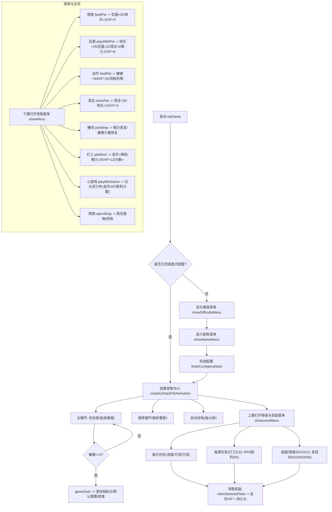
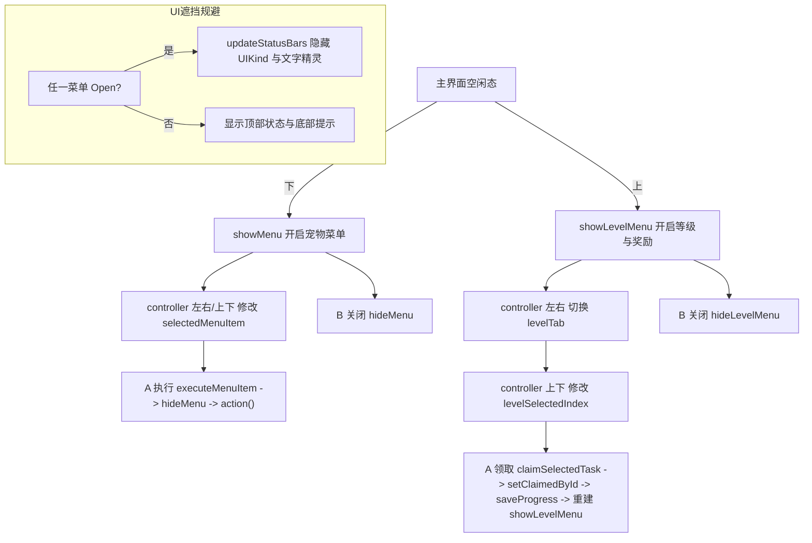
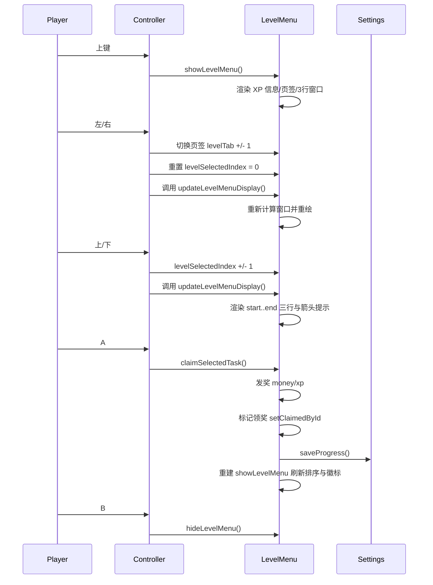

# 电子宠物饲养游戏

一个在 MakeCode Arcade 上运行的简易电子宠物游戏。你需要照顾宠物的饥饿、快乐、健康、清洁与精力，进行打工、小游戏与购物，完成每日/每周任务与成就，并通过升级解锁更多奖励。

[⭐️⭐️⭐️在线试玩(v1.1.0)⭐️⭐️⭐️](https://arcade.makecode.com/44892-00714-58783-29633)

## 截图

下列为游戏截图（screenshots 目录）：

## 玩法概述

- 五项状态：饥饿、快乐、健康、清洁、精力（顶部进度条显示）
- 菜单功能：喂食、玩耍、治疗、清洁、睡觉、说话、打工、小游戏（石头剪刀布）、购物
- 昼夜系统：每 30 秒游戏内时间推进一小时，19:00-6:00 为夜晚，夜晚亮度降低且精力消耗更快
- 难度与昵称：首次进入需选择难度（简单/普通/困难）与昵称，存档持久化
- 任务奖励：
  - 每日任务：喂食3次、玩耍2次、清洁1次、治疗1次、打工1次
  - 每周任务：打工5次与10次、猜拳胜利3次与5次
  - 成就：等级达到3/5/10/15，金钱达到500/1000/2000
- 存档机制：自动每 10 秒保存一次；重置、领取奖励与升级也会保存

## 操作指南

- 下键：打开宠物菜单（主界面空闲状态）
- 上键：在主界面打开“等级与奖励”菜单
- A：菜单内确认；等级与奖励菜单中领取选中项
- B：返回或关闭当前菜单；在睡眠模式下唤醒宠物
- 方向键：在菜单网格或列表中移动选择

调试与隐藏功能：
- DEBUG 重置：同时按 下+A+B（带 1 秒去抖）重置并初始化菜单状态
- 隐藏加钱：同时按 上+A+B 每次增加 1000 金币（带 1 秒去抖）

## 系统细节

- 自动衰减：
  - 简单难度：每 16000ms 衰减
  - 普通难度：每 8000ms 衰减
  - 困难难度：每 4000ms 衰减
  - 饥饿/清洁/精力过低会加速其他状态的负面影响
- 睡眠：
  - 进入睡眠后每秒恢复精力（最多 30 秒或至满），健康少量恢复
  - 满精力或超时自动醒来
- 打工：
  - 消耗 20 精力，获得 10-30 金币与经验，累积每日/每周计数
- 石头剪刀布：
  - 赢：+15 金币与经验10；平：+5 金币与经验3；负：+3 金币与经验2
  - 每周胜利计数用于任务
- 购物：
  - 食物 20 金币、药物 30 金币，背包数量持久化
- 经验与升级：
  - 下一级所需经验：100 + (等级-1)*50
  - 每次升级奖励 +50 金币与提示

## 数据持久化

通过 settings.* API 存储：
- 宠物状态、经济与库存、昼夜时间、难度与昵称
- 等级与经验
- 任务计数与领奖标记（每日/每周/成就）

重置逻辑（DEBUG）会：
- 清空存档标记
- 重建默认状态
- 初始化所有菜单状态与选择索引为关闭与默认

## 主要流程图

如需变更操作逻辑或任务/成就档位，请提出具体目标值与奖励，我会快速调整并同步更新 README。

## UI 菜单切换与状态栏遮挡规避（详细）

- 入口与切换：
  - 下键：在主界面空闲态打开“宠物菜单”（showMenu）。
  - 上键：在主界面空闲态打开“等级与奖励菜单”（showLevelMenu）。
  - A：在当前菜单执行所选项（宠物菜单执行菜单动作；等级与奖励菜单执行领取；游戏菜单执行出拳；商店执行购买）。
  - B：关闭当前菜单并返回上一层；若无菜单则在主界面触发随机说话。若处于睡眠模式，B 优先唤醒宠物。
- 多菜单互斥与切换规则：
  - 菜单状态变量：menuState、gameMenuState、shopMenuState、configMenuState、nameMenuState、levelMenuState。每个菜单打开时对应状态置为 Open，关闭置为 Closed。
  - 切换策略：B 关闭当前菜单；从小游戏/商店返回自动重回宠物菜单以便继续操作；等级与奖励与宠物菜单互斥，避免层叠。
- 状态栏与 UI 遮挡规避：
  - 核心点：updateStatusBars 会检测是否“任一菜单打开”，若是则设置顶/底文字精灵与所有 UIKind 状态条为 Invisible，避免与菜单界面互相遮挡。
    - anyMenuOpen = 任意一个菜单状态为 Open（menuState 或 game/shop/config/name/level）。
    - 将 topTextSprite、bottomTextSprite 与饥饿/快乐/健康/清洁/精力五条以及所有 UIKind 精灵设置 Invisible。
  - 菜单背景与内容全部使用 MenuKind 独立绘制，互斥于 UIKind 层，避免深浅色块穿插导致视觉混叠。
- 宠物菜单（九宫格）选择与重绘：
  - 数据结构：menuItems（含 name、icon、action）。选中项索引 selectedMenuItem。
  - 显示：createMenuSprites 每次重建内容精灵（保留背景），3x3 网格布局，选中项红底白字，普通项深色文字。
  - 导航：
    - 左/右：在同一行中横向移动（controller.left/right 更新 selectedMenuItem）。
    - 上/下：按 3 步跨行移动（controller.up/down 对索引 ±3）。
  - 执行：A 触发 executeMenuItem，先 hideMenu，再调用选中项 action。
- 其它菜单的打开与关闭：
  - 游戏菜单：showGameMenu / hideGameMenu；选项为“石头/剪刀/布”，上下选择，A 执行对战。
  - 商店菜单：showShopMenu / hideShopMenu；上下选择“食物/药物”，A 购买并更新金钱显示。
  - 配置菜单（首次启动）：showDifficultyMenu 与 showNameMenu，A 进入下一步或完成配置，B 在昵称菜单随机刷新候选。
  - 等级与奖励菜单：见下节。

## 等级与奖励菜单的左右切换与上下滚动（详细）

- 入口与结构：
  - 上键打开 showLevelMenu，状态 levelMenuState=Open。
  - 顶部信息条显示 Lv.x 与 XP 当前值与到下一级所需（xpToNextLevel = 100 + (level-1)*50），并绘制进度条。
  - 页签区：每日/每周/成就 三个标签，右侧用“*”标识该页内可领取条目数（分别通过 getDailyTasks/getWeeklyTasks/getAchievementTasks 的 canClaim 统计）。
- 左右切换页签（如何实现）：
  - 变量 levelTab 表示当前页签（0=每日，1=每周，2=成就）。
  - 控制器：
    - controller.left/right 在 levelMenuState==Open 时对 levelTab 执行 ±1，并重置 levelSelectedIndex 与 levelScrollOffset。
    - 调用 updateLevelMenuDisplay：销毁局部 levelMenuSprites，再重建显示（showLevelMenu 会根据新的 levelTab 刷新列表）。
- 上下滚动选择（如何实现）：
  - 变量：
    - levelSelectedIndex：当前选中的任务索引（全量列表索引）。
    - levelVisibleRows=3：窗口一次展示 3 行。
    - levelCursorRow=1：光标固定在窗口中间行（第 2 行），通过滑动窗口实现上下滚动。
  - 计算窗口：
    - tasks = getCurrentTasks() 会对任务排序：可领 > 未完成 > 已领；其次按完成率降序。
    - start = clamp(levelSelectedIndex - levelCursorRow, 0, tasks.length - levelVisibleRows)
    - end = min(tasks.length, start + levelVisibleRows)
    - 循环渲染 start..end 的 3 行，光标所在行填充选中底色。顶部/底部若还有更多内容，会额外绘制“↑/↓”箭头提示。
  - 控制器：
    - controller.up/down 在 levelMenuState==Open 时对 levelSelectedIndex ±1（边界保护），并调用 updateLevelMenuDisplay 重新计算窗口与重绘。
- 领取奖励与持久化：
  - A 键执行 claimSelectedTask：
    - 取当前 tasks[levelSelectedIndex]，若 t.canClaim 为真则发放奖励：money += rewardMoney，gainXP(rewardXP)。
    - 标记领奖：setClaimedById(t.id) 针对不同任务/成就置 claimed_xxx=true。
    - saveProgress 持久化所有状态、计数与领奖标记。
    - 刷新显示：销毁 MenuKind 层后重建 showLevelMenu，确保排序与徽标数量即时更新。
- 经验与升级联动：
  - gainXP(n) 会处理跨级：XP 溢出时提升 level，并给予 +50 金币升级奖励；随后 updateStatusBars 与 saveProgress 使 UI 与存档同步。
  - 成就页的“等级达到 N”会因 level 增加而变为可领（canClaim），并在页签徽标与顶部“↑n”提示中体现。
- 顶部提示与全局“可领数”指示：
  - updateStatusBars 顶部条右侧会打印“↑总待领数”，为每日/每周/成就三个列表的可领项之和，提醒玩家按上键进入领取。
- 交互摘要：
  - 左右：切页（每日/每周/成就）。
  - 上下：在固定光标模式下滚动列表，光标始终居中。
  - A：领取选中任务/成就的奖励。
  - B：关闭等级与奖励菜单返回主界面。

以上说明与 main.ts 中的控制器事件、菜单状态变量、任务构建/排序与重绘逻辑完全对应，便于后续维护或扩展（如增加页签、调整窗口大小、改变排序或奖励数值）。

### 附加示意图

菜单切换与遮挡规避流程

等级与奖励菜单交互序列

### 术语与排版微调建议

- 统一术语：
  - “宠物菜单”指九宫格功能菜单；“等级与奖励菜单”指每日/每周/成就页签菜单。
  - “窗口”指等级菜单一次显示的 3 行视图；“光标固定中行”指 levelCursorRow=1 的居中选中行。
- 排版细节：
  - 顶部时间与“待领数”提示建议使用高对比度颜色（白/红），夜晚模式下维持可读性。
  - 九宫格项文字建议统一左内边距 2px，图标与文字对齐，选中项红底白字保持一致性。
  - 等级菜单页签的“*”徽标可替换为数字圈（如 "(2)"），提高语义性。

### 代码引用标注（便于查阅）

- UI遮挡与状态条：updateStatusBars（约 main.ts 中部），关键点 anyMenuOpen 与 UIKind/MenuKind 隐显。
- 宠物菜单（九宫格）：showMenu/createMenuSprites/updateMenuSelection/executeMenuItem；控制器事件 controller.left/right/up/down。
- 小游戏菜单：showGameMenu/createGameMenuSprites/updateGameMenuDisplay/executeGameChoice。
- 商店菜单：showShopMenu/createShopMenuSprites/updateShopMenuDisplay/executePurchase。
- 等级与奖励菜单：showLevelMenu/updateLevelMenuDisplay/hideLevelMenu；数据来源 getDailyTasks/getWeeklyTasks/getAchievementTasks；领奖 claimSelectedTask/setClaimedById/saveProgress。
- 经验与升级：gainXP/xpToNextLevel；升级奖励+50金币。
- 首次配置：showDifficultyMenu/proceedToNameMenu/showNameMenu/finishConfigAndStart；组合键调试：debugResetGame。

注：函数名与变量名均可在 main.ts 直接搜索定位。

### 操作速查表

- 主界面：
  - 上键：打开等级与奖励菜单
  - 下键：打开宠物菜单
  - A：确认/执行当前菜单动作
  - B：返回或关闭当前菜单；睡眠模式下优先唤醒
- 宠物菜单（九宫格）：
  - 左/右：横向移动；上/下：跨行移动（±3）
  - A：执行选中项；B：关闭
- 等级与奖励菜单：
  - 左/右：切换每日/每周/成就页签
  - 上/下：滚动选择（光标固定中行）
  - A：领取选中奖励；B：关闭
- 小游戏/商店：
  - 上/下：选择；A：确认（出拳/购买）；B：返回（小游戏/商店返回到宠物菜单）
- 首次配置：
  - 难度：上/下选择，A确认
  - 昵称：A确认，B随机

### 截图示例占位（建议拍摄并替换）

- 宠物菜单九宫格：screenshots/2.png（建议标注选中态与金钱/库存Bar位置）
- 等级与奖励菜单-每日页签：screenshots/3.png（建议标注XP进度条、页签徽标与三行窗口）
- 等级与奖励菜单-成就页签：screenshots/4.png（建议标注“↑总待领数”与领取后排序变化）
- 夜晚模式：screenshots/1.png（建议展示暗背景与顶部时间可读性）

### 交互边界与异常处理

- 睡眠优先唤醒：任意界面按 B 若 sleeping 为真，先 stopSleepMode，再处理返回逻辑。
- 菜单互斥：所有菜单通过各自状态位（MenuState.Open/Closed）互斥显示；updateStatusBars 统一隐藏 UIKind，避免遮挡。
- 索引边界保护：
  - 宠物菜单：selectedMenuItem 在 0..menuItems.length-1 内；上下移动跨行时自动裁剪。
  - 等级菜单：levelSelectedIndex 在 0..tasks.length-1 内，start/end 通过窗口裁剪确保不越界。
- 首次配置流程保护：CONFIG_DONE_KEY 未完成时仅允许难度/昵称菜单；其余系统更新（自动衰减/昼夜）会避开黑屏。
- 存档安全：saveProgress 每 10 秒自动保存；领奖/升级/新一天/切周等关键事件即时保存。
- 结束保护：health<=0 触发 gameOver，清存档标记与重建默认值，避免下次加载到异常状态。

### 视觉规范建议（实用落地）

- 色板：
  - 选中底色：menuSelectedFontBgColor=2（红）; 选中文字：menuSelectedFontColor=1（白）
  - 普通文字：menuFontColor=12；Bar 背景：menuBarBgColor=6；标题：menuTitleColor=15（白）
- 夜间可读性：
  - 顶部时间/“↑待领数”建议使用高对比（白/亮红），避免深蓝背景下发灰
  - screen.setBrightness(60) 生效后，文字颜色尽量选择 1/2/15 等高亮色
- 对齐与留白：
  - 九宫格项统一内边距 2px；图标与文字左对齐，保证视觉稳定
  - 等级菜单 3 行窗口高度统一 16px；页签间距保持 40px，便于一眼识别
- 徽标语义化：
  - 页签“*”可换成数字徽标（如 "(2)"）；顶部“↑n”保留，强调全局待领总数
- 动画与特效：
  - 升级与领奖使用 effects.confetti 短时触发（<=800ms），避免与睡眠动画冲突