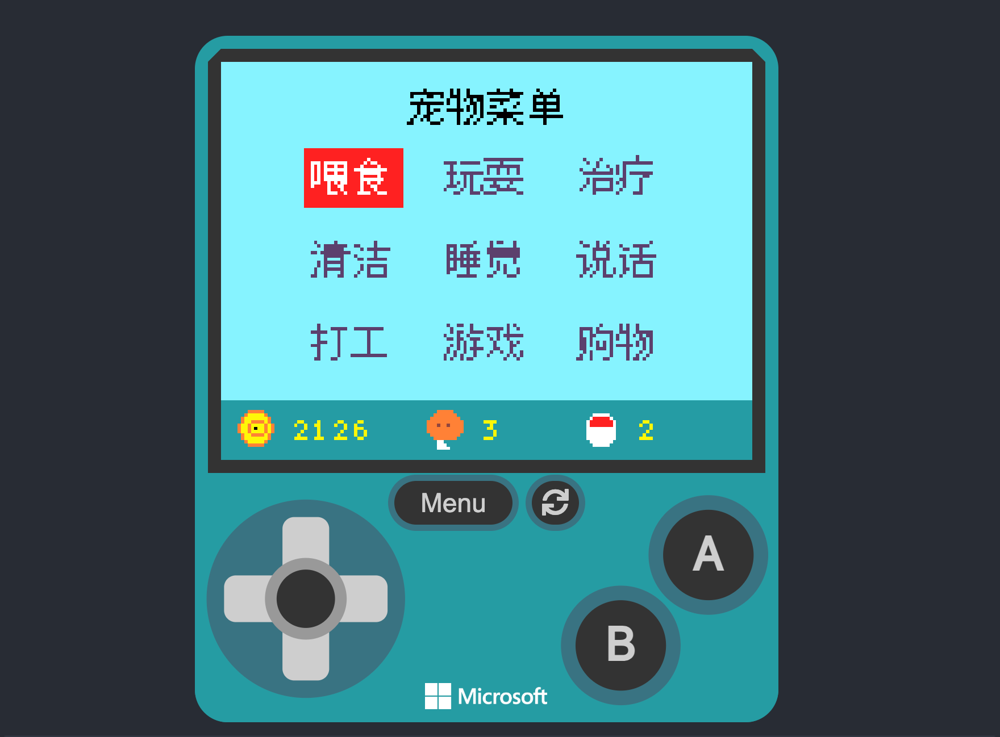
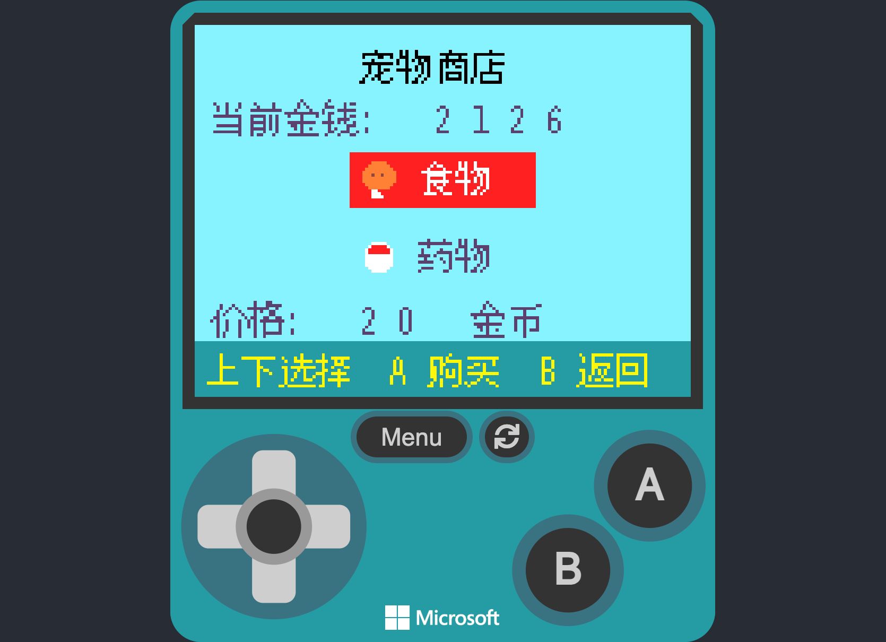
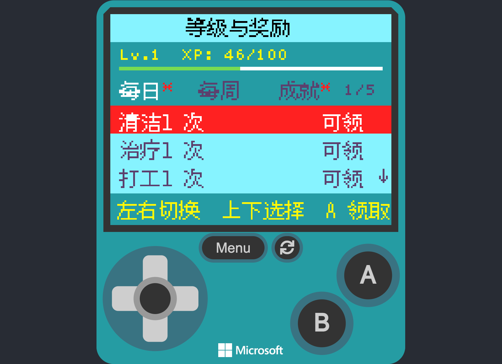
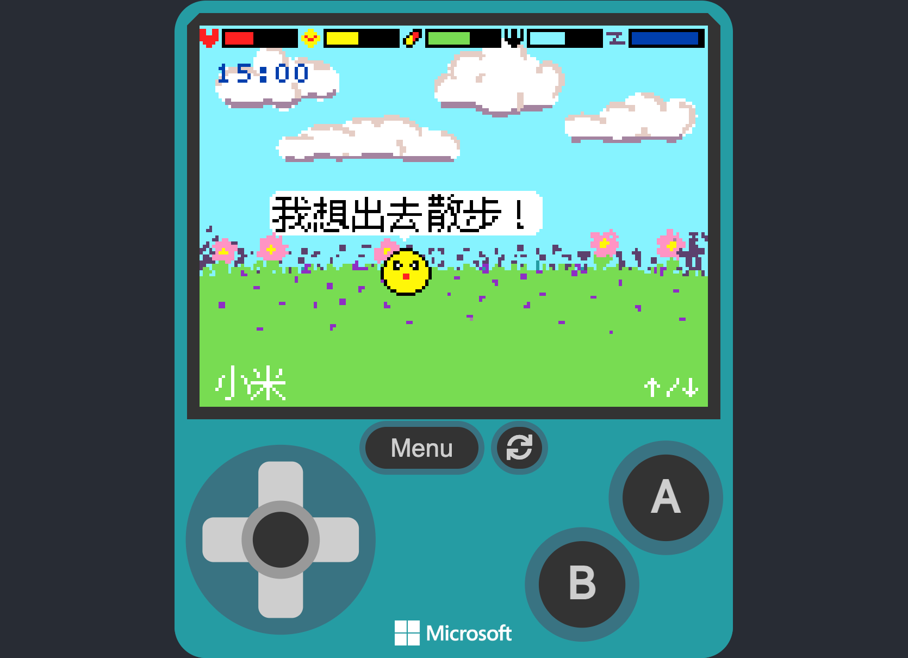
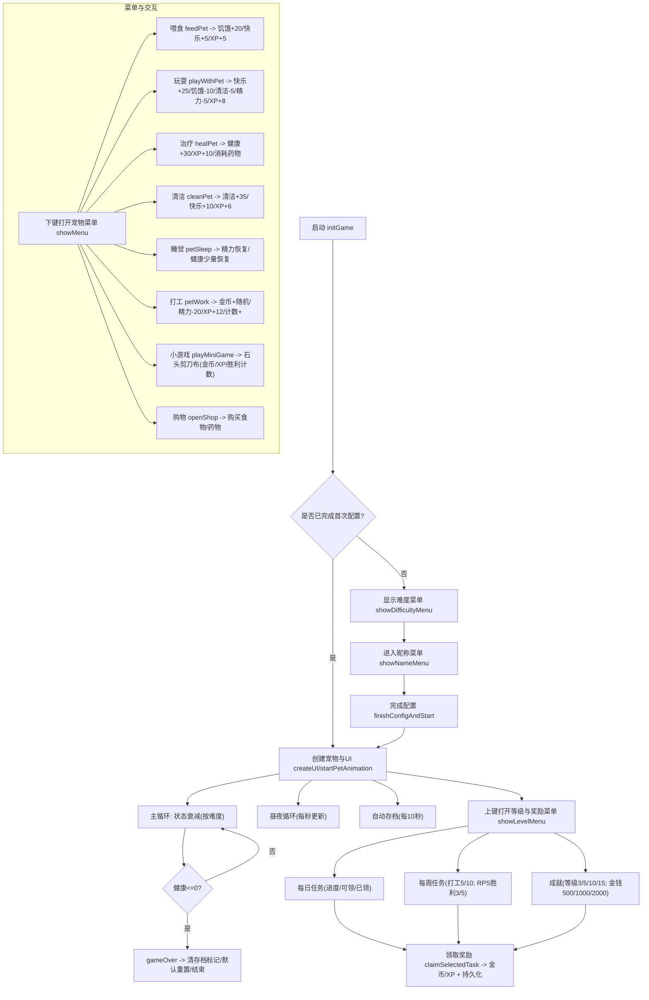

# 电子宠物饲养游戏

一个在 MakeCode Arcade 上运行的简易电子宠物游戏。你需要照顾宠物的饥饿、快乐、健康、清洁与精力，进行打工、小游戏与购物，完成每日/每周任务与成就，并通过升级解锁更多奖励。

[⭐️⭐️⭐️在线试玩(v1.1.0)⭐️⭐️⭐️](https://arcade.makecode.com/44892-00714-58783-29633)

## 截图

下列为游戏截图（screenshots 目录）：

## 玩法概述

- 五项状态：饥饿、快乐、健康、清洁、精力（顶部进度条显示）
- 菜单功能：喂食、玩耍、治疗、清洁、睡觉、说话、打工、小游戏（石头剪刀布）、购物
- 昼夜系统：每 30 秒游戏内时间推进一小时，19:00-6:00 为夜晚，夜晚亮度降低且精力消耗更快
- 难度与昵称：首次进入需选择难度（简单/普通/困难）与昵称，存档持久化
- 任务奖励：
  - 每日任务：喂食3次、玩耍2次、清洁1次、治疗1次、打工1次
  - 每周任务：打工5次与10次、猜拳胜利3次与5次
  - 成就：等级达到3/5/10/15，金钱达到500/1000/2000
- 存档机制：自动每 10 秒保存一次；重置、领取奖励与升级也会保存

## 操作指南

- 下键：打开宠物菜单（主界面空闲状态）
- 上键：在主界面打开“等级与奖励”菜单
- A：菜单内确认；等级与奖励菜单中领取选中项
- B：返回或关闭当前菜单；在睡眠模式下唤醒宠物
- 方向键：在菜单网格或列表中移动选择

调试与隐藏功能：
- DEBUG 重置：同时按 下+A+B（带 1 秒去抖）重置并初始化菜单状态
- 隐藏加钱：同时按 上+A+B 每次增加 1000 金币（带 1 秒去抖）

## 系统细节

- 自动衰减：
  - 简单难度：每 16000ms 衰减
  - 普通难度：每 8000ms 衰减
  - 困难难度：每 4000ms 衰减
  - 饥饿/清洁/精力过低会加速其他状态的负面影响
- 睡眠：
  - 进入睡眠后每秒恢复精力（最多 30 秒或至满），健康少量恢复
  - 满精力或超时自动醒来
- 打工：
  - 消耗 20 精力，获得 10-30 金币与经验，累积每日/每周计数
- 石头剪刀布：
  - 赢：+15 金币与经验10；平：+5 金币与经验3；负：+3 金币与经验2
  - 每周胜利计数用于任务
- 购物：
  - 食物 20 金币、药物 30 金币，背包数量持久化
- 经验与升级：
  - 下一级所需经验：100 + (等级-1)*50
  - 每次升级奖励 +50 金币与提示

## 数据持久化

通过 settings.* API 存储：
- 宠物状态、经济与库存、昼夜时间、难度与昵称
- 等级与经验
- 任务计数与领奖标记（每日/每周/成就）

重置逻辑（DEBUG）会：
- 清空存档标记
- 重建默认状态
- 初始化所有菜单状态与选择索引为关闭与默认

## 主要流程图

如需变更操作逻辑或任务/成就档位，请提出具体目标值与奖励，我会快速调整并同步更新 README。